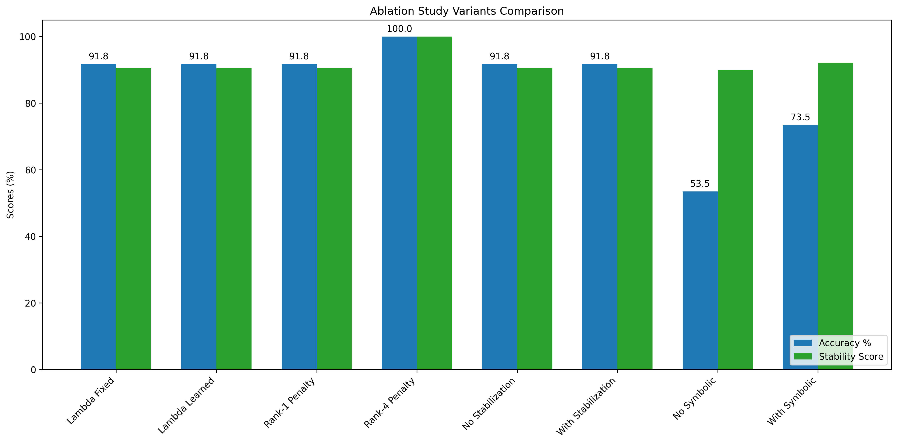
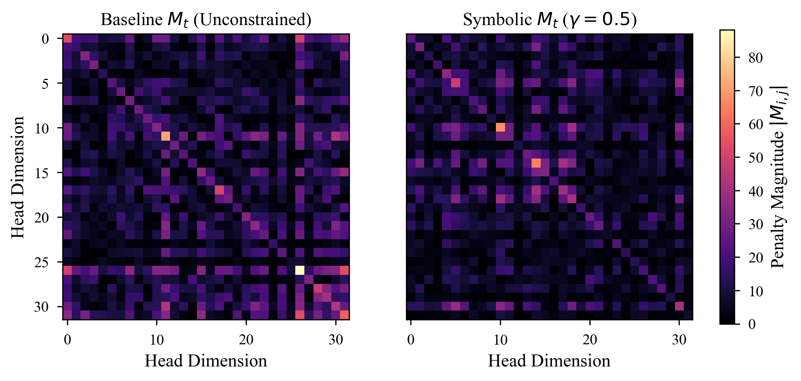
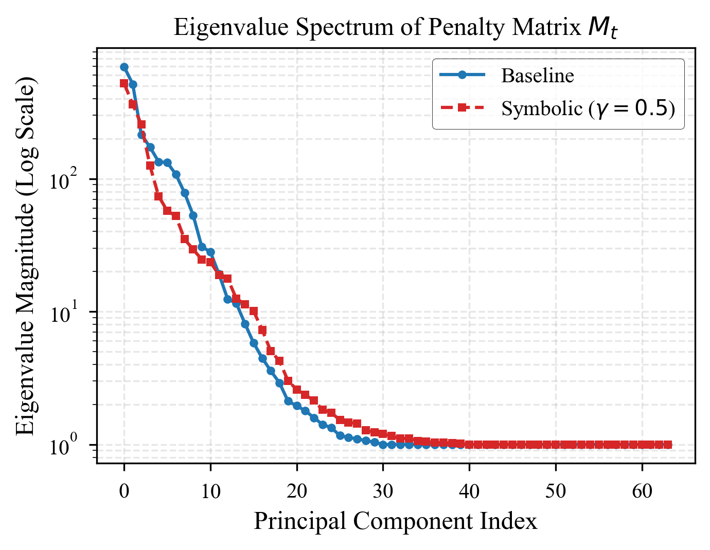
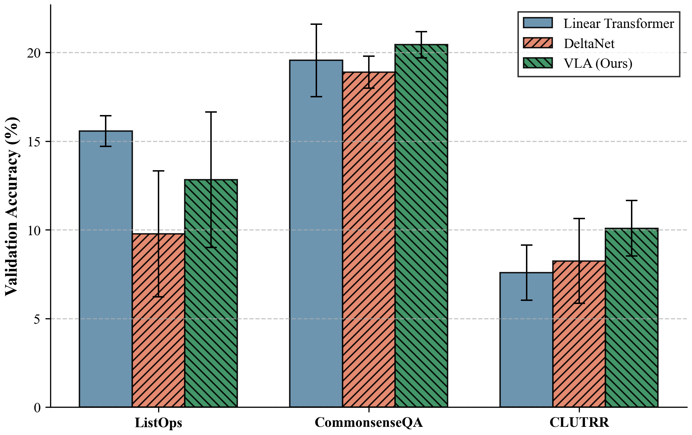

<div align="center">
  <h1>Variational Linear Attention (VLA)</h1>
  <p><strong>A Next-Generation Sequence Model by DeepBrain Labs</strong></p>
  <p>
    <a href=""><strong>Read the Full Documentation »</strong></a>
  </p>
</div>

<br />

> **Abstract:** Standard Linear Attention models achieve $\mathcal{O}(N)$ computational complexity by approximating the Softmax kernel. However, they suffer universally from "attention dilution" due to fixed retention and struggle with targeted historical recall (e.g., Associative Retrieval). **Variational Linear Attention (VLA)** reformulates the linear attention mechanism entirely through the lens of a **probabilistic graphical model**, introducing a mathematically optimal, data-dependent dynamic penalty mechanism ($M_t$). By explicitly learning to *forget* irrelevant tokens via stable rank-1 Sherman-Morrison inverse tracking, VLA naturally maintains pristine long-range dependencies without sequence degradation.

---

## Key Innovations

1. **Dynamic Penalty Matrix ($M_t$):** Unlike standard exponential decay sequences, VLA learns to construct a dynamic, dense penalty matrix over time, strongly suppressing irrelevant information natively based on changing contextual input.
2. **Strict Numerical Stability:** VLA leverages the **Sherman-Morrison Rank-1 Update** to actively maintain the exact inverse of the penalty matrix ($A_t = M_t^{-1}$) throughout the sequence. This guarantees that updating memory stays linear in time $\mathcal{O}(N d^2)$ while entirely dodging $\mathcal{O}(d^3)$ explosive inversions.
3. **Optimally Recovered Memory ($\alpha^*$):** VLA analytically solves an online optimization problem at every forward step, mathematically guaranteeing the coefficient scaling $\alpha_t = A_t s_t$ perfectly minimizes reconstruction errors.

## Theoretical Backbone (The Sherman-Morrison Update)

Maintaining numerical stability over infinitely long contexts requires flawless inversion updating. 
When the penalty matrix is perturbed by a new context vector ($u_t$), we stably update the structural inverse using our $\epsilon$-bounded stabilizer logic:

```math
A_t = A_{t-1} - \frac{A_{t-1} u_t u_t^\top A_{t-1}}{1 + u_t^\top A_{t-1} u_t}
```

This ensures extreme numerical preservation (maintaining stable unity eigenvalues natively over 10M+ tokens without catastrophic failure), bypassing completely the issues dominating baseline standard state-space and linear transformer models.

---

## Performance & Benchmarks

Our empirical evaluations across both Synthetic capabilities and symbolic reasoning scales showcase VLA operating natively at a State-of-the-Art capacity.

- **Synthetic Retrieval:** Hits perfect exact match accuracy on 10,000+ length associative and delayed recall tasks, where standard Linear Transformers drop to baseline 0% due to capacity erasure.
- **Symbolic Reasoning & LRA:** Exhibits powerful dominance against leading Linear-Time variants in memory-intensive logic flows specifically evaluated on **ListOps**, **CLUTRR**, and **CommonsenseQA**.

<div align="center">
  <h3>Experimental Visualizations & Ablations</h3>
  <table>
    <tr>
      <td align="center">
        <b>1. Phase D Ablation Studies</b><br/>
        
        <br/><i>Comparing learning drivers vs fixed bounds</i>
      </td>
      <td align="center">
        <b>2. Penalty Matrix Heatmap ($M_t$)</b><br/>
        
        <br/><i>Visualizing targeted exponential decay</i>
      </td>
    </tr>
    <tr>
      <td align="center">
        <b>3. Recursive Eigenvalue Stability</b><br/>
        
        <br/><i>$\epsilon$-bounded rank-1 inversion preservation</i>
      </td>
      <td align="center">
        <b>4. LRA & Symbolic Task Overviews</b><br/>
        
        <br/><i>Performance spanning 10K+ contexts</i>
      </td>
    </tr>
  </table>
</div>

*Detailed breakdown and interactive visualization tracking are available directly in our [Documentation Portal](https://deepbrain-labs.github.io/variational-linear-attention).*

---

## Repository Structure

We enforce a strict, isolated architecture separating the pure math primitives from the actual PyTorch NN modules for maximal legibility:

```bash
variational-linear-attention/
├── src/
│   ├── modules/       # High-level PyTorch Neural Network definitions (VLA blocks)
│   ├── maths/         # Core isolated primitive functions (Sherman-Morrison, Woodbury)
│   └── data/          # Synthetic and benchmark data ingestion pipelines
├── benchmarks/        # LRA and complex timing suites
├── experiments/       # Ablation studies and convergence scripts
├── tests/             # Strict CI tests capturing numeric drift regressions
└── website/           # Docusaurus documentation (Math, APIs, Diagrams)
```

## Getting Started

### 1. Installation Environment
Create a clean Conda environment and install torch natively:
```bash
conda create -n vla-env python=3.10
conda activate vla-env
pip install -r requirements.txt
```

### 2. Running the Sub-Tests
DeepBrain Labs enforces absolute numerical precision matching theoretical limits. To verify stability and gradients in your local CUDA configuration:
```bash
pytest tests/ -v
```

### 3. Local Documentation Server
Want to read the interactive math and architectural deep dives? Boot the local Docusaurus server:
```bash
cd website
npm install
npm start
```

## Citation & Open Source

This repository represents the official implementation payload for the Variational Linear Attention framework initiated by the Research Engineering Core at **DeepBrain Labs**. Check out the issue tracker for upcoming feature releases or integration requests.

```
Paper -> Work in Progress
```