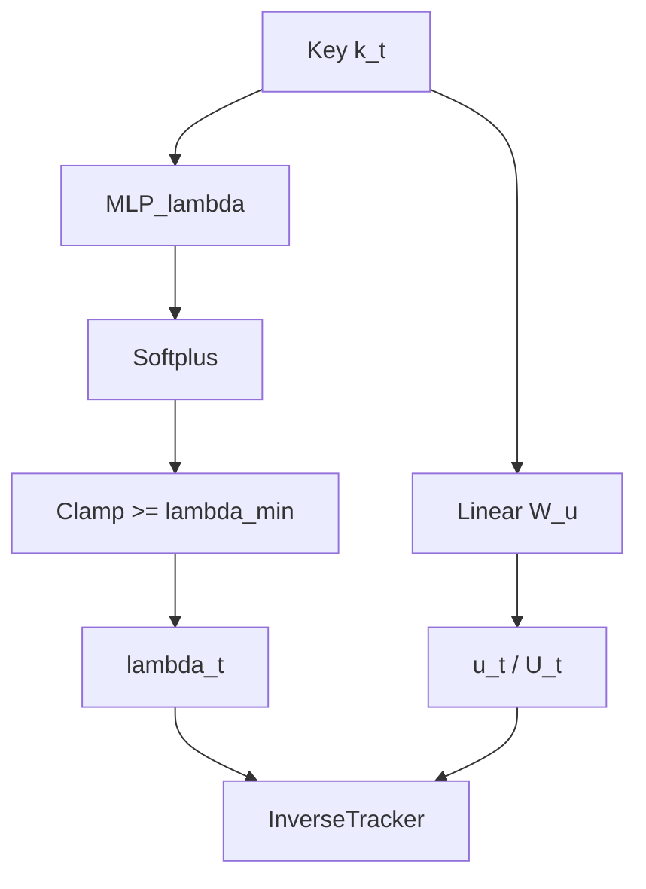

# Penalty Builder Module

## Overview

The `PenaltyBuilder` is the central component that grants Variational Linear Attention its adaptive memory capabilities. Located in `src/models/attention/penalty_builder.py`, this module constructs the data-dependent penalty matrix $M_t(\theta)$ at each timestep $t$. By parameterizing $M_t$, the model learns exactly how to weigh and forget historical information.

The module supports multiple parameterizations for the penalty matrix, balancing expressivity and computational cost.

---

## Parameterizations

### 1. Diagonal + Rank-1 ($M_t = \lambda_t I + u_t u_t^\top$)

The simplest and most robust parameterization. The matrix is decomposed into a uniform decay scalar ($\lambda_t$) and a rank-1 outer product ($u_t u_t^\top$), which allows the model to selectively penalize specific directions in the key-space.

**Formulas:**
$$
\lambda_t = \text{softplus}(\text{MLP}_\lambda(k_t))
$$
$$
u_t = W_u k_t
$$

**Implementation Constraints:**
-   $\lambda_t$ is strictly clamped to $\ge \lambda_{\text{min}}$ (e.g., $10^{-3}$) to guarantee positive definiteness.
-   $W_u \in \mathbb{R}^{d \times d}$ is a learnable projection matrix mapping the key dimension to the update vector.
-   **Output:** Returns the tuple `(\lambda_t, u_t)`.

### 2. Diagonal + Rank-r ($M_t = \lambda_t I + \sum_{m=1}^r u_{t,m} u_{t,m}^\top$)

A higher-capacity parameterization that allows the model to penalize an $r$-dimensional subspace at each step.

**Formulas:**
$$
\lambda_t = \text{softplus}(\text{MLP}_\lambda(k_t))
$$
$$
u_{t,m} = W_{u,m} k_t \quad \text{for } m = 1, \dots, r
$$

**Implementation Constraints:**
-   $U_t = [u_{t,1}, \dots, u_{t,r}]$ is computed efficiently via a single batched linear projection $W_u \in \mathbb{R}^{(r \cdot d) \times d}$ and subsequently reshaped into $(B, r, d)$.
-   **Output:** Returns `(\lambda_t, U_t)`.

### 3. Kernelized Penalty (Low-rank Approximation)

This parameterization uses a generic feature map $\phi(x)$ to approximate full kernelized penalty landscapes.

**Formulas:**
$$
M_t \approx \lambda I + \phi_t \phi_t^\top
$$
$$
\phi_t = W_\phi k_t
$$

*Note: Currently implemented via `KernelPenaltyBuilder`. This shares the logic of Rank-1 but is designed for future expansions into full RBF kernel approximations.*

---

## Recurrence & Inverse Tracking

The outputs from the `PenaltyBuilder` are not used as $M_t$ directly; doing so would require $\mathcal{O}(d^3)$ inversion. Instead, $\lambda_t$ and $u_t$ are passed to the `InversePenaltyTracker` module.

> **Crucial Detail**: In `VLALayer`, the time-varying scalar $\lambda_t$ from `PenaltyBuilder` is **unused** in the $A_t$ update step. The recurrence strictly relies on $u_t$ and an initial $\lambda_0$. Consequently, the parameters within the $\lambda$-network (`lambda_net`) do not receive gradients during the standard VLA forward pass.

---

## Inputs and Outputs

**Inputs:**
-   $k_t$: The input key vector. Shape: `(B, d)` for streaming auto-regressive decoding, or `(B, T, d)` for batch-training.

**Outputs:**
-   $\lambda_t$: Scalar base penalty. Shape: `(B, 1)` or `(B, T, 1)`.
-   $u_t$ (or $U_t$): Update vector(s). Shape: `(B, d)` / `(B, T, d)` for rank-1, or `(B, r, d)` / `(B, T, r, d)` for rank-$r$.
-   `stats`: A dictionary containing internal tracking statistics (e.g., mean norms, eigenvalues) for logging via WandB or TensorBoard. Modules must return this dictionary rather than invoking logging frameworks directly.

---

## Computation Graph

