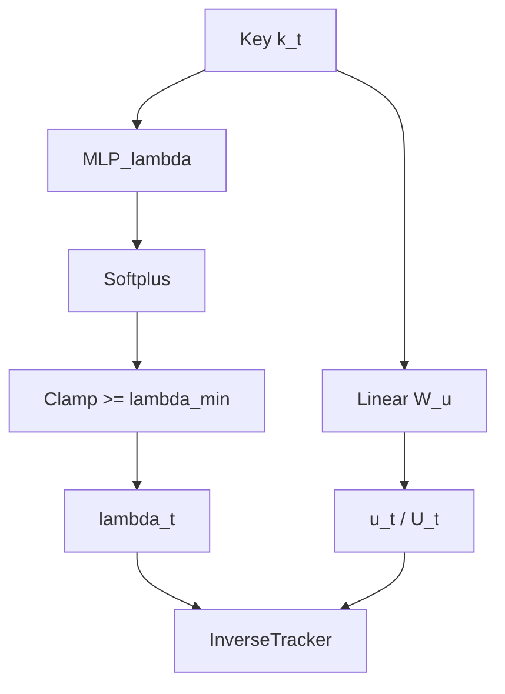

# Penalty Builder Module

## Overview

The `PenaltyBuilder` module constructs the penalty matrix $M_t(\theta)$ at each timestep.
It supports multiple parameterizations for the penalty matrix.

## Parameterizations

### 1. Diagonal + Rank-1

**Definition:**
$$ M_t = \lambda_t I + u_t u_t^T $$

**Formulas:**
$$ \lambda_t = \text{softplus}(\text{MLP}_\lambda(k_t)) $$
$$ u_t = W_u k_t $$

**Implementation:**
- $\lambda_t$ is clamped to be $\ge \lambda_{min}$.
- $W_u$ is a learnable matrix of shape $(d \times d)$.
- Returns $(\lambda_t, u_t)$.

### 2. Diagonal + Rank-r

**Definition:**
$$ M_t = \lambda_t I + \sum_{m=1}^r u_{t,m} u_{t,m}^T $$

**Formulas:**
$$ \lambda_t = \text{softplus}(\text{MLP}_\lambda(k_t)) $$
$$ u_{t,m} = W_{u,m} k_t $$

**Implementation:**
- $\lambda_t$ is computed as above.
- $U_t = [u_{t,1}, \dots, u_{t,r}]$ is computed via a single projection $W_u$ of shape $(r \cdot d \times d)$ and reshaped.
- Returns $(\lambda_t, U_t)$.

### 3. Kernelized Penalty (Low-rank Approximation)

**Definition:**
$$ M_t \approx \lambda I + \phi_t \phi_t^T $$

**Formulas:**
$$ \phi_t = W_\phi k_t $$

**Implementation:**
- Currently implemented via `KernelPenaltyBuilder`.
- Same logic as Rank-1 but intended for future expansion to full kernel approximations.

## Inputs and Outputs

**Inputs:**
- $k_t$: Key vector. Shape $(B, d)$ (streaming) or $(B, T, d)$ (training).

**Outputs:**
- $\lambda_t$: Scalar penalty. Shape $(B, 1)$ or $(B, T, 1)$.
- $u_t$ / $\phi_t$: Update vector(s). Shape $(B, d)$ / $(B, T, d)$ for rank-1, or $(B, r, d)$ / $(B, T, r, d)$ for rank-r.
- `stats`: Dictionary of internal statistics (means, norms, etc.).

## Diagram

The outputs `lambda_t` and `u_t` are fed into the Inverse Tracker module (Sherman-Morrison updates).
